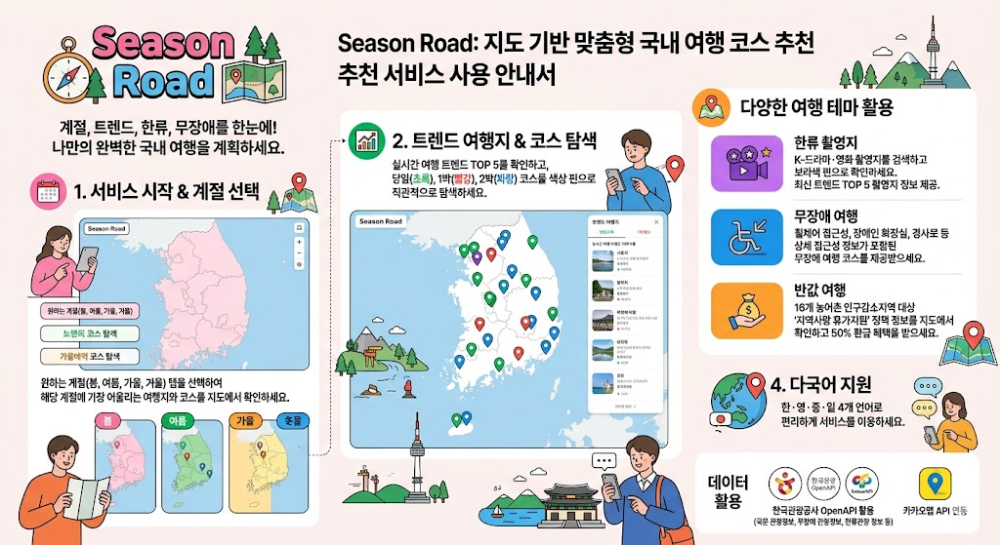

# 🗺️ Season Road 사용 가이드

> 계절과 트렌드로 이어지는 여행 코스 추천 웹서비스



👉 **바로 사용하기**: https://hiation33-arch.github.io/season-road

---

## 📌 목차

1. [서비스 소개](#서비스-소개)
2. [화면 구성](#화면-구성)
3. [계절 여행 코스](#계절-여행-코스)
4. [지금 뜨는 여행지 TOP5](#지금-뜨는-여행지-top5)
5. [한류 드라마 촬영지](#한류-드라마-촬영지)
6. [무장애 여행](#무장애-여행)
7. [반값 여행 (지역사랑 휴가지원)](#반값-여행)
8. [다국어 지원](#다국어-지원)
9. [지도 핀 안내](#지도-핀-안내)
10. [개발자 정보](#개발자-정보)

---

## 서비스 소개

**Season Road**는 계절별 추천 여행 코스와 트렌드 여행지를 지도 위에서 한눈에 확인할 수 있는 여행 코스 추천 서비스입니다.

- 🌸 계절에 맞는 여행지를 한눈에
- 🔥 지금 뜨는 트렌드 여행지 확인
- 🎬 한류 드라마 촬영지 탐방
- ♿ 시니어·장애인 맞춤 무장애 코스
- 💰 반값 여행 (인구감소지역 50% 환급)
- 🌏 한·영·중·일 4개국어 지원

---

## 화면 구성

```
┌──────────────────────────────────────────┐
│  🗺️ SeasonRoad  🔍 검색창  KO EN ZH JA  │  ← 헤더 + 언어 선택
├──────────────────────────────────────────┤
│  🌸봄  🌿여름  🍂가을  ❄️겨울  🎬한류    │  ← 계절/한류 탭
├──────────────────────────────────────────┤
│  ♿ 무장애 여행  (토글 버튼)              │  ← 무장애 필터
├───────────────────┬──────────────────────┤
│  💰 반값 여행 배너 │                      │
│  ─────────────── │    지도               │
│  🔥 트렌드 TOP5  │  (핀 표시)            │
│  계절 추천 TOP5  │  🔴🟢 💰🟢            │
│  선택된 장소 정보 │  🔵🟣🟡              │
└───────────────────┴──────────────────────┘
```

---

## 계절 여행 코스

### 사용 방법

1. 상단 탭에서 **원하는 계절** 클릭
   - 🌸 **봄** — 벚꽃, 봄꽃 명소
   - 🌿 **여름** — 해수욕장, 계곡, 녹음
   - 🍂 **가을** — 단풍, 억새, 가을 축제
   - ❄️ **겨울** — 설경, 눈꽃 축제, 온천

2. 지도에 해당 계절 핀이 표시됩니다

3. 왼쪽 패널에서 두 가지 정보 확인
   - **🔥 지금 뜨는 여행지 TOP5** — 트렌드 인기 순위
   - **계절 추천 여행지 TOP5** — 계절별 대표 여행지

4. 목록에서 여행지 클릭 → 지도가 해당 위치로 이동

### 핀 클릭 시

지도의 핀을 클릭하면 정보가 표시됩니다:
- 장소명 및 코스 유형 (당일/1박/2박)
- 장소 설명
- 관련 해시태그
- 소요 기간 및 위치
- **반값 여행 대상 지역인 경우 💰 환급 안내 배지 표시**

---

## 지금 뜨는 여행지 TOP5

계절 탭을 선택하면 왼쪽 패널 상단에 **현재 트렌드 여행지 TOP5**가 표시됩니다.

| 순위 | 색상 | 의미 |
|------|------|------|
| 1위 | 🔴 빨강 | 가장 인기 |
| 2위 | 🟠 주황 | 상승 중 |
| 3위 | 🟡 노랑 | 주목 |
| 4~5위 | ⚫ 기본 | 트렌드 |

---

## 한류 드라마 촬영지

### 사용 방법

1. 상단 탭에서 **🎬 한류** 클릭
2. 왼쪽 패널에 **지금 뜨는 드라마 TOP5** 표시
3. 드라마 카드 클릭 → 해당 드라마 촬영지만 지도에 표시
4. 다시 클릭 → 전체 드라마 보기로 복귀

### 현재 수록 드라마

| 드라마 | 장르 | 촬영지 수 |
|--------|------|----------|
| 오징어게임 시즌2 | 스릴러·서바이벌 | 3곳 |
| 선재 업고 튀어 | 타임슬립·로맨스 | 3곳 |
| 도깨비 | 판타지·로맨스 | 3곳 |
| 눈물의 여왕 | 로맨스·드라마 | 2곳 |
| 사랑의 불시착 | 로맨스·드라마 | 2곳 |
| 이태원 클라쓰 | 청춘·복수극 | 2곳 |
| 응답하라 1988 | 가족·복고 | 2곳 |

---

## 무장애 여행

시니어·장애인도 편하게 즐길 수 있는 여행지를 안내합니다.

### 사용 방법

1. 탭바 아래 **♿ 무장애 여행** 버튼 클릭 (활성 시 주황색으로 변경)
2. 지도에 황금색(🟡) 무장애 핀 표시
3. 계절 탭과 **동시에 사용 가능**
4. 버튼 다시 클릭 → 무장애 필터 해제

### 추천 무장애 코스

| 코스명 | 유형 | 경로 |
|--------|------|------|
| 서울 문화 당일 코스 | 당일 | 국립중앙박물관 → 경복궁 → 한강공원 여의도 |
| 제주·순천 힐링 코스 | 1박 2일 | 제주 사려니숲길 → 순천만 국가정원 |
| 경주·부산 역사 코스 | 2박 3일 | 불국사 → 해운대 해수욕장 |

---

## 반값 여행

**💰 지역사랑 휴가지원** — 인구감소지역 16개 방문 시 여행경비 50% 환급

### 대상 지역 (16개)

| 도/광역시 | 지역 |
|-----------|------|
| 강원 | 평창, 영월, 횡성 |
| 충북 | 제천 |
| 전북 | 고창 |
| 전남 | 강진, 영광, 해남, 고흥, 완도, 영암 |
| 경남 | 밀양, 하동, 합천, 거창, 남해 |

### 환급 한도

- 개인: 최대 **10만원**
- 2인 이상: 최대 **20만원**

### 신청 기간

2026년 4월 ~ 6월 말

### 이용 방법

1. 지도에서 **💰 뱃지**가 표시된 핀 클릭
2. 상세 정보에서 환급 안내 확인
3. 왼쪽 패널 상단 배너 클릭 → 한국관광공사 공식 사이트 이동

---

## 다국어 지원

헤더 우측 언어 버튼으로 전환: **KO / EN / ZH / JA**

| 항목 | 한국어 | English | 中文 | 日本語 |
|------|--------|---------|------|--------|
| 탭 이름 | 봄/여름/가을/겨울/한류 | Spring/Summer/... | 春季/夏季/... | 春/夏/... |
| 무장애 버튼 | ♿ 무장애 여행 | ♿ Accessible Travel | ♿ 无障碍旅行 | ♿ バリアフリー旅行 |
| 반값 배너 | 지역사랑 휴가지원 | Half-Price Travel | 半价旅游支援 | 半額旅行支援 |

---

## 지도 핀 안내

| 색상 | 종류 | 설명 |
|------|------|------|
| 🟢 초록 | 당일 코스 | 하루 안에 다녀올 수 있는 여행지 |
| 🔴 빨강 | 1박 코스 | 1박 2일 추천 여행지 |
| 🔵 파랑 | 2박 코스 | 2박 3일 추천 여행지 |
| 🟣 보라 | 한류 촬영지 | 드라마·영화 촬영 장소 |
| 🟡 황금 | 무장애 여행지 | 시니어·장애인 접근 가능 |
| 💰 뱃지 | 반값 여행 | 여행경비 50% 환급 가능 지역 |

---

## 개발자 정보

### GitHub Secrets 등록 방법

GitHub Actions를 통해 API 키를 안전하게 관리합니다. `main` 브랜치에 push하면 자동으로 키가 주입되어 GitHub Pages에 배포됩니다.

#### 등록 경로

`GitHub 저장소 → Settings → Secrets and variables → Actions → New repository secret`

#### 등록할 Secrets

| Secret 이름 | 설명 | 발급처 |
|------------|------|--------|
| `KAKAO_JS_KEY` | 카카오 JavaScript 앱 키 | https://developers.kakao.com |
| `TOUR_API_KEY` | 한국관광공사 Tour API 서비스 키 | https://api.visitkorea.or.kr |

> **주의**: `index.html`에는 실제 키 대신 `__KAKAO_JS_KEY__`, `__TOUR_API_KEY__` 플레이스홀더가 들어 있으며, 배포 시 GitHub Actions가 자동으로 교체합니다. 실제 키를 코드에 직접 커밋하지 마세요.

### 한국관광공사 OpenAPI 연동

현재 더미 데이터 사용 중. 실제 API 연동 준비 완료.

- API 키 발급: https://api.visitkorea.or.kr
- GitHub Secret `TOUR_API_KEY`에 등록하면 자동 적용
- 각 데이터 항목에 `apiId` (콘텐츠 ID) 포함되어 있어 즉시 교체 가능

### 기술 스택

- 순수 HTML/CSS/JavaScript (빌드 도구 불필요)
- 카카오맵 API
- Pretendard 폰트 (CDN)
- 한국관광공사 Tour API 4.0 (연동 구조 완성)
- GitHub Actions / GitHub Pages (자동 배포)

---

## 💡 이용 팁

- **계절 탭 + 무장애 버튼** 동시 활성화로 계절별 무장애 여행지만 볼 수 있어요
- **한류 탭**에서 드라마 카드를 클릭하면 해당 드라마 촬영지만 모아볼 수 있어요
- **💰 뱃지 핀**을 클릭하면 반값 여행 환급 안내를 바로 확인할 수 있어요
- **KO/EN/ZH/JA** 버튼으로 언어를 전환하면 모든 UI 텍스트가 즉시 변경돼요
- 핀이 여러 개 겹쳐 있을 때는 **지도를 확대**하면 개별 핀을 선택할 수 있어요

---

*Season Road — 2026 한국관광공사 관광데이터 활용 공모전 출품작*
